## Introduction
(Contributed by all members)

Welcome to ProductiveNUS User Guide! :blue_book:

**ProductiveNUS is a desktop application** made for you, **a School of Computing (SoC) student in National University of Singapore (NUS)**, to **manage and schedule your academic tasks more effectively**. It makes use of a **Graphical User Interface (GUI)**, which provides you with an intuitive interface and immediate visual feedback. ProductiveNUS uses a **Command Line Interface (CLI)**; this means that you operate the application by typing commands into a [Command Box](#gui-terminologies). If you are fast at typing, you can manage your academic tasks more efficiently.

As a **student in NUS SoC**, you tend to have a **heavy workload**. ProductiveNUS helps **improve your productivity** by **enhancing your organisational skills**. Apart from simply **keeping track of your tasks**, ProductiveNUS is capable of **scheduling** them for you so you will never **miss any deadlines**. ProductiveNUS is also compatible with NUSMods. This means that your **timetable information can be easily imported** into the application and **all** your academic tasks can be found in just **one application**.

## Table of Contents

* Table of Contents
{:toc}

## About
(Contributed by Jia Xin and Andrea)

This user guide provides you with the necessary information on how to become an expert user of ProductiveNUS. 
You can familiarize yourself with the terminologies, syntax and icons used in this user guide by reading the following sub-sections.  

### GUI terminologies

The figure below shows the GUI of ProductiveNUS, with its sections labelled. 
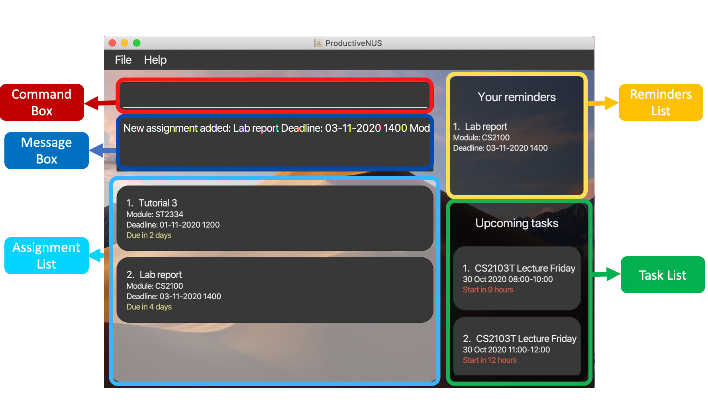
*Figure 1: Labelled GUI sections*

### Icon usages

Wondering what each icon is used for? You can refer to the table below to find out.

| Icon        | Icon usage                                             | Box color |
|-------------|--------------------------------------------------------|-----------|
| :clipboard: | - Notes about the command format - Pointers to note | Blue      |
| :bulb:      | - Tip                                                  | Green     |

### Command syntax

All the commands and their examples are formatted as `markups`.

**:clipboard: Notes about the command format:** 

* Words in `UPPER_CASE` are the parameters to be supplied by you. 
  e.g. in `add n/NAME_OF_ASSIGNMENT`, `NAME_OF_ASSIGNMENT` is a parameter which can be used as `add n/Assignment 2`.

* Items in square brackets are optional. 
  e.g `n/NAME_OF_ASSIGNMENT [remind]` can be used as `n/Assignment 2 remind` or as `n/Assignment 2`.

* Parameters can be in any order unless otherwise stated. 
  e.g. if the command specifies `n/NAME_OF_ASSIGNMENT d/DEADLINE_OF_ASSIGNMENT`, `d/DEADLINE_OF_ASSIGNMENT n/NAME_OF_ASSIGNMENT` is also acceptable.
  
* All instances of `INDEX` **must be a positive integer**. 
  e.g. 1, 2, 3, …​

### Date and time format

All commands with date and/or time parameters have a specific format you must follow, else your input will be deemed as invalid.

#### Date

Date parameters must be in the format `dd-MM-yyyy`, where `dd` is day of the month, `MM` is month and `yyyy` is year. The number of repeated letters indicate the number of digits required for day of the month, month and year. 

For example, `dd` means that the day of the month has to be a 2-digit number. Hence, for dates you want to input from the 1st to the 9th of any month, you must key in `09-01-2020`. `9-01-2020` will be deemed as invalid. Likewise for month and year, `09-1-2020` and `09-01-20` will be deemed as invalid.

#### Time

Time parameters must be in the format `HHmm`, where `HH` is the hour of the day and `mm` is the minute of the hour. You must input the time according to the 24-hour clock system.

For example, 7:00 AM is `0700` while 7:00 PM is `1900`.

## Getting started

1. Ensure you have Java `11` or above installed in your Computer.

1. Download the latest `productivenus.jar` from [here](https://github.com/AY2021S1-CS2103T-F11-3/tp/releases).

1. Copy the file to the folder you want to use as the _home folder_ for ProductiveNUS.

1. Double-click the file to start the app. The GUI similar to the below should appear in a few seconds. Note how the app contains some sample data. If the app does not start, please refer to our [FAQ](#faq) section for other ways to start the app. 

   
   *Figure 2: ProductiveNUS GUI*

1. Refer to the [Features](#features) below for details of each command.

## Features

### Adding an assignment: `add`
(Contributed by Jerry)

Format: `add n/NAME_OF_ASSIGNMENT d/DEADLINE_OF_ASSIGNMENT mod/MODULE_CODE_OF_ASSIGNMENT [p/PRIORITY_OF_ASSIGNMENT] 
[remind]`

You can add assignments into your [Assignment List](#gui-terminologies) to manage and keep track of all your academic tasks. 

For example, to add a lab report assignment that is **due on 23th April 2020 12.30pm** and **associated with the module CS2100**, you can 
simply enter `add n/Lab report d/23-04-2020 1230 mod/CS2100`. Once the assignment is added, it will appear in the Assignment List and all its information will be displayed as shown in the figure below.

   
   *Figure 3: Information of the assignment added labelled*

**:bulb: Tip:**
If the lab report assignment is very urgent, you can attach a **high priority tag** to it by entering `add n/Lab report d/23-04-2020 1230 mod/CS2100 p/HIGH`.

 

 **:clipboard: Pointers to note:** 
* If you intend to set reminders to your assignment, `[remind]` has to be the **last parameter** entered. For example, `add n/Lab report d/23-04-2020 1230 mod/CS2100 remind p/HIGH` will not be accepted. Instead, you should enter `add n/Lab report d/23-04-2020 1230 mod/CS2100 p/HIGH remind`.
* You cannot add the same assignment twice. This means that you cannot add an assignment that already exist in your Assignment List.

More examples:
* `add n/Lab report d/23-04-2020 1230 mod/CS2100 remind`
* `add n/Lab report d/23-04-2020 1230 mod/CS2100 p/HIGH remind`

### Deleting assignments : `delete`
(Contributed by Andrea)

Format: `delete INDEX [MORE_INDEXES]`

You can delete **one or more** assignments from your [Assignment List](#gui-terminologies) by specifying the `INDEX` of each assignment you want to delete as shown in your list.

Here is an example with steps for you to follow:

1) To delete assignments with the name "Statistics tutorial" and "Biology lab report" as shown in the figure below, you can simply enter `delete 1 3` into the [Command Box](#gui-terminologies) which corresponds to their indexes in the Assignment List.

*Figure 4: `delete 1 3` inputted by user and location of assignment indexes*

2) You have successfully deleted both assignments from the Assignment List, and they are no longer displayed.

3) A "Deleted Assignment(s)" message that includes the information of your deleted assignments will be displayed in the [Message Box](#gui-terminologies).

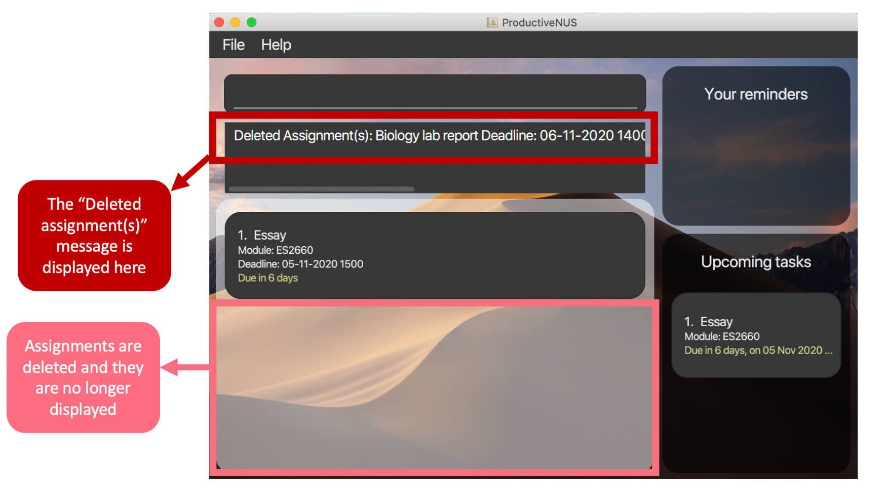
*Figure 5: The displayed message and the updated list*

More examples:
* `delete 1`
* `delete 2 3 1`

 **:clipboard: Pointers to note:** 
* At least one index must be **present**. For example, `delete` without any index is invalid.
* The indexes **must be found in your Assignment List**.
* The indexes **must not be duplicated**. For example, `delete 3 3` is invalid.

### Importing your timetable : `import`
(Contributed by Yong Kang)

Format: `import url/YOUR_NUSMODS_URL`

It is tedious to have to constantly switch between your browser and ProductiveNUS when you want to refer to your
timetable. But, you can transfer your timetable into ProductiveNUS using import.

You can transfer your timetable into ProductiveNUS by providing the URL to your NUSMods timetable share link.
 
Follow these steps and try importing your timetable:

1) At your NUSMods timetable website, click on the "Share/Sync" button to obtain your timetable share link URL.

   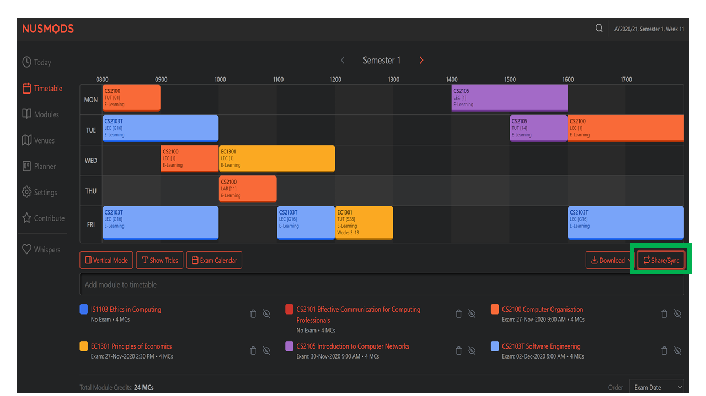
   *Figure 6: The "Share/Sync" at the NUSMods website highlighted in green*

2) The URL obtained will be `YOUR_NUSMODS_URL` to be used in the import command. Key in `import url/YOUR_NUSMODS_URL`.

3) This may take a few seconds. After the import process, the added lesson information can be found in your
`Upcoming tasks` list.

   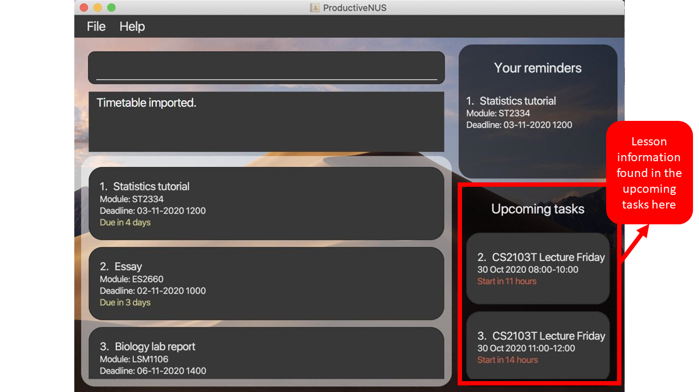
   *Figure 7: Added lesson information can be found in the `Upcoming tasks` list highlighted in red*

 **:clipboard: Pointers to note:** 
* Importing a new timetable will override your previous timetable data.

An example:
* `import url/https://nusmods.com/timetable/sem-1/share?CS2100=TUT:01,LAB:11,LEC:1&CS2101=&CS2103T=LEC:G16&CS2105=TUT:14,LEC:1&EC1301=TUT:S28,LEC:1&IS1103=` 

### Listing assignments : `list`
(Contributed by Andrea)

Format: `list [NUMBER_OF_DAYS]`

You can list all your assignments with `list`. Alternatively, you can type `list` followed by an index `NUMBER_OF_DAYS`, which must be **from 1 to 50**. `list NUMBER_OF_DAYS` will list your assignments with deadlines that fall within this number of days from the current date.

**:bulb: Tip:**
You can use the `NUMBER_OF_DAYS` index to quickly view assignments that you need to complete soon!

Here is an example with steps for you to follow: 

1) You can enter `list 3` as shown in the diagram below to list your assignments that are due within 3 days from the current date. 

*Figure 8: `list 3` inputted by user*

2) Assignments found are displayed in the [Assignment List](#gui-terminologies). 

3) A message that indicates the number of assignments listed is displayed in the [Message Box](#gui-terminologies).

*Figure 9: The displayed message and the updated list*

More examples: 
- `list`
- `list 7`
 

 **:clipboard: Pointers to note:** 
* **Only one** number can be keyed in. For example, `list 1 2` is invalid. 

### Finding assignments : `find`
(Contributed by Andrea)

Format: `find PREFIX/KEYWORD [MORE_KEYWORDS]`

You can find your assignments based on keywords you enter. The types of keywords are the name, module code, deadline and priority of an assignment. 

**:bulb: Tip:**
If your [Assignment List](#gui-terminologies) is really long, this command comes in handy as it filters the list based on assignments u want to see!

This is the table of prefixes used:

| Prefix | Syntax | Example |
|-|-|-|
| `n/` | n/NAME_OF_ASSIGNMENT [MORE_NAME_OF_ASSIGNMENT] | -`n/Tutorial` |
| `mod/` | mod/MODULE_CODE_OF_ASSIGNMENT [MORE_MODULE_CODE_OF_ASSIGNMENT] | -`mod/ST2334` |
| `d/` | d/DUE_DATE_OR_TIME_OF_ASSIGNMENT [MORE_DUE_DATE_OR_TIME_OF_ASSIGNMENT] | -`d/24-10-2020 1300` |
| `p/` | p/PRIORITY_OF_ASSIGNMENT [MORE_PRIORITY_OF_ASSIGNMENT] | -`p/HIGH` |

 **:clipboard: Pointers to note for prefixes and keywords:** 
* For prefix `d/`, date and time from the deadline of an assignment are separate. Date keywords are **irrespective of time** and time keywords are **irrespective of date**. For example, `find d/1300 25-11-2020` finds all assignments due on 25-11-2020, at any time of the day and all assignments due at 1300, on any date.
* Keywords used with prefixes `n/`,`mod/` and `p/` are **case-insensitive**.

Here is an example with steps for you to follow:

1) To find assignments from the modules CS2100 and ST2334, you can simply key in `find mod/CS2100 ST2334`. 

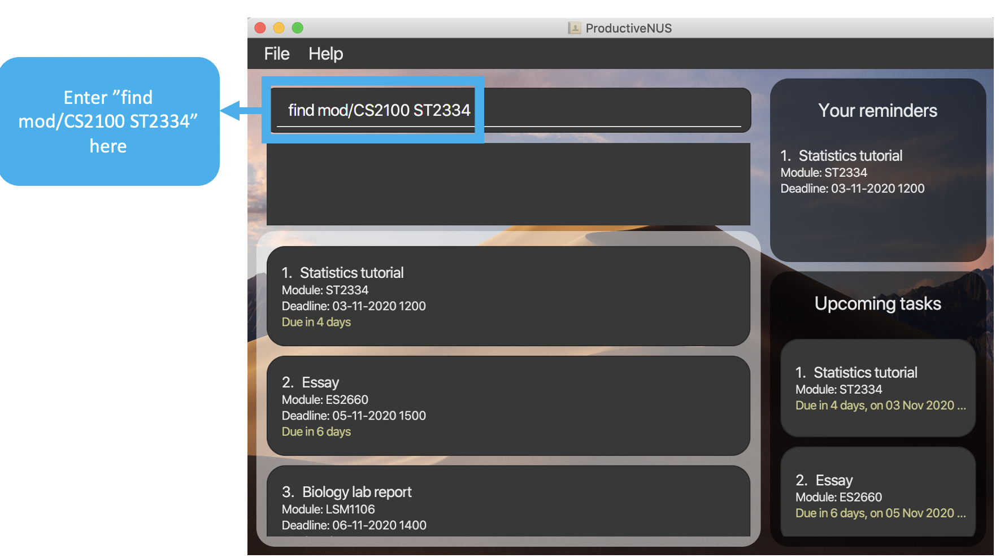
*Figure 10: `find mod/CS2100 ST2334` inputted by user*

2) Assignments from the modules CS2100 and ST2334 will appear in the Assignment List.

3) A message that indicates the number of assignments found is displayed in the [Message Box](#gui-terminologies).

*Figure 11: The displayed message and the updated list*

More examples: 
- `find p/medium low`
- `find d/12-12-2020 13-10-2020`

 **:clipboard: Pointers to note:** 
* You can only **find assignments with keywords of the same prefix**. For example, `find n/Assignment d/23-10-2020` is invalid.

### Editing an assignment : `edit`
(Contributed by Andrea)

Format: `edit INDEX PREFIX/EDITED_FIELD [MORE_PREFIX/EDITED_FIELD]`

You can specify an assignment's index to edit its fields. These fields are the name, module code and deadline of an assignment.

**:bulb: Tip:**
You can edit more than one field of an assignment at a time so that you can conveniently amend all spelling errors or mistakes when adding assignments! For example, you can key in `edit 1 n/Tutorial mod/CS2103T` to edit both the name and module code in a single command.

This is the table of prefixes used:

| Prefix | Syntax | Example |
|-|-|-|
| `n/` | n/NAME_OF_ASSIGNMENT | -`n/Tutorial` |
| `mod/` | mod/MODULE_CODE_OF_ASSIGNMENT | -`mod/ST2334` |
| `d/` | d/DEADLINE_OF_ASSIGNMENT | -`d/24-10-2020 1300` |

Here is an example with steps for you to follow:

1) To edit the name of the assignment with the first index in the [Assignment List](#gui-terminologies) to "Statistics Lab", you can simply key in `edit 1 n/Statistics Lab` in the [Command Box](#gui-terminologies). 

*Figure 12: `edit 1 n/Statistics Lab` inputted by user and location of assignment index*

2) The name of the assignment is changed to "Statistics Lab".

3) A message that indicates details of the edited assignment is displayed in the [Message Box](#gui-terminologies).

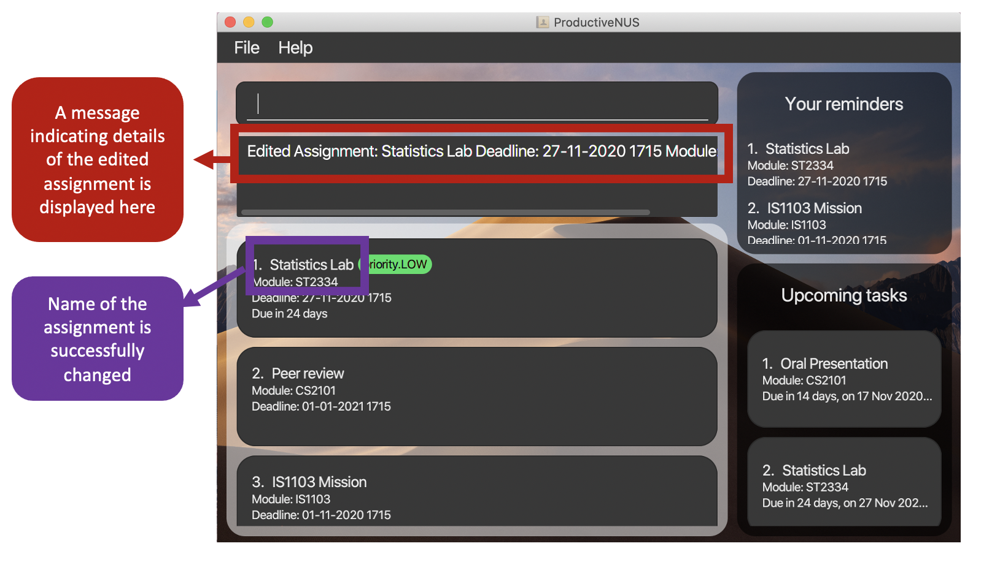
*Figure 13: The displayed message and the edited assignment*

More examples: 
- `edit 3 mod/CS2100`
- `edit 1 d/10-10-2020 1200 mod/CS2106`

 **:clipboard: Pointers to note:** 
* **One** `INDEX` and **at least one** `PREFIX/EDITED_FIELD` must be present. For example, `edit` is invalid.

### Setting reminders for assignments : `remind`
(Contributed by Jia Xin)

Format: `remind INDEX [MORE_INDEXES]`

You can set reminders for specific assignments which will be displayed in `Your reminders` (Highlighted in red in the figure below) for your easy referral.

   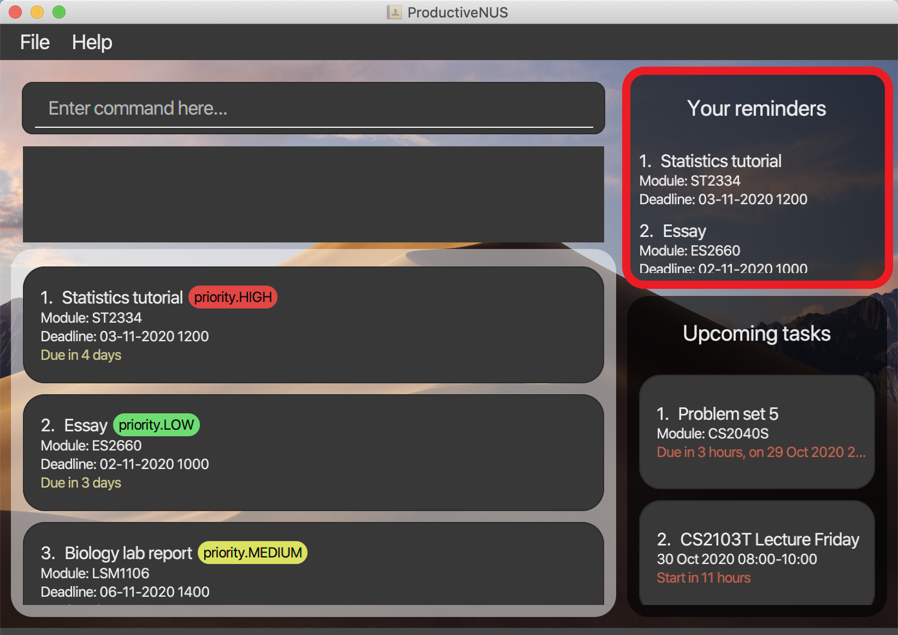
   *Figure 14: `Your reminders` highlighted in red*

You can use the `INDEX` of the assignment as shown in your [Assignment List](#gui-terminologies) to set reminders for that assignment. 

For example, `remind 1` will set reminders for the first assignment in your assignment list ("Statistics tutorial" as shown in the figure below) and adds it to `Your reminders`.

   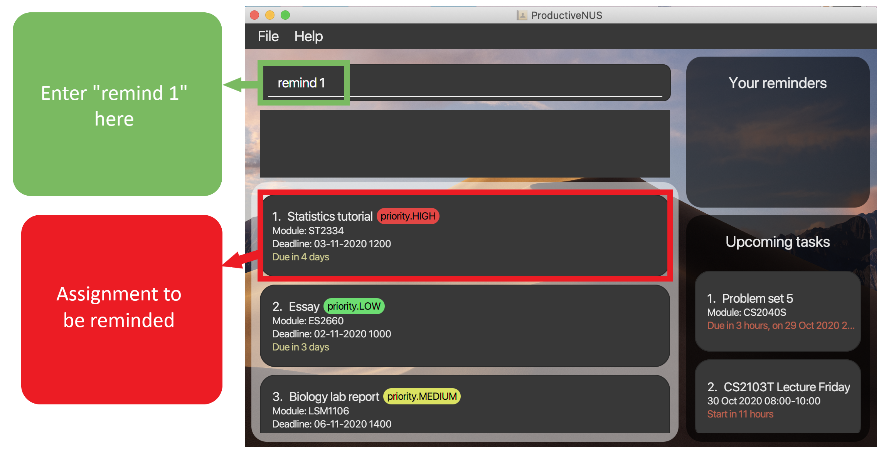
   *Figure 15: Before "Statistics tutorial" is added into `Your reminders`*
      
   
   *Figure 16: "Statistics tutorial" (highlighted in red) is added into `Your reminders`*

You can set reminders for **multiple** assignments at a time as well. Here is an example with steps for you to follow:

1) To set reminders for assignments "Essay" and "Assignment 3" (the second and fourth assignment respectively in your assignment list as shown in the figure below), you can simply enter `remind 2 4` into the [Command Box](#gui-terminologies).

   
   *Figure 17: Before "Essay" and "Assignment 3" are added into `Your reminders`*

2) You have successfully set reminders for both assignments, and they can now be found under `Your reminders`.

   
   *Figure 18: "Essay" and "Assignment 3" (highlighted in red) are added into `Your reminders`*

  
**:clipboard: Pointers to note:** 
* At least one `INDEX` must be present. For example, `remind` is invalid.
* The `INDEX` must be found in your Assignment List.

### Removing reminders for assignments : `unremind`
(Contributed by Jia Xin)

Format: `unremind INDEX`

You can remove your reminded assignments from `Your reminders` by specifying the `INDEX` of the assignment as shown in `Your reminders`. 

For example, `unremind 1` will remove the first assignment in `Your reminders` ("Statistics tutorial" as shown in the figures below).

   
   *Figure 19: Before "Statistics tutorial" (highlighted in red) is removed from `Your reminders`*
      

      
   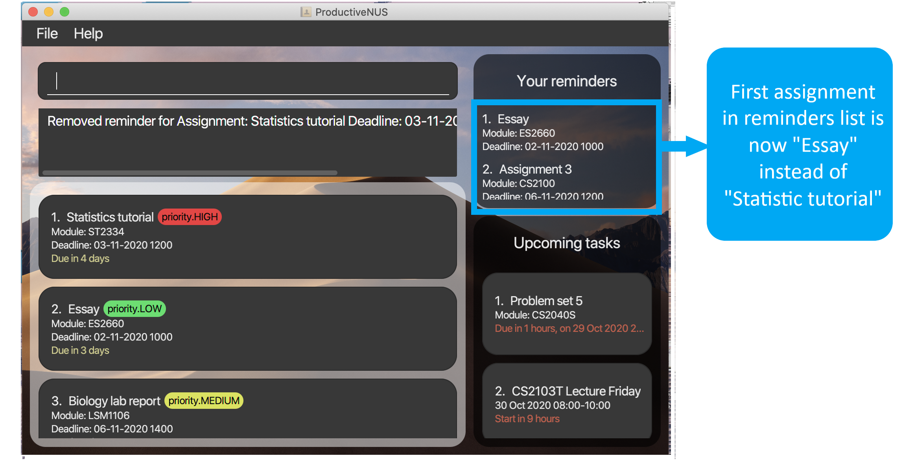
   *Figure 20: "Statistics tutorial" is removed from`Your reminders`*

  
**:clipboard: Pointers to note:** 
* At least one `INDEX` must be present. For example, `unremind` is invalid.
* The `INDEX` must be found in `Your reminders`.

### Setting priority for assignments : `prioritise`
(Contributed by Yong Kang)

Format: `prioritise INDEX p/PRIORITY_OF_ASSIGNMENT`

You may have certain assignments that are of greater urgency than the others. It would be easier if you could categorise
your assignments based on their priority.

You can set three different priority levels for assignments based on their urgency. Assignments tagged with a priority
level will be shown with a coloured priority tag beside your assignment name (As shown highlighted in red in the figure
below).

   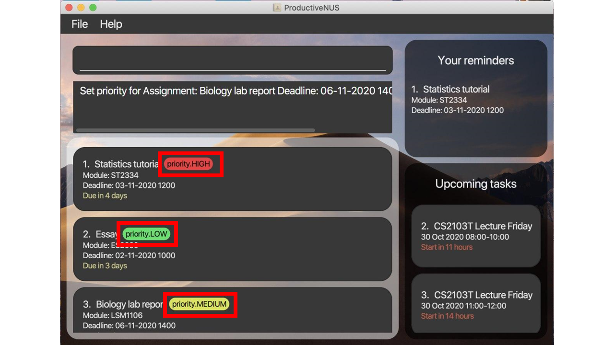
   *Figure 21: The priority tags of assignments highlighted in red*

You can use the `INDEX` of the assignment as shown in your [Assignment List](#gui-terminologies) to set priority tag for that assignment.

For example, `prioritise 3 p/MEDIUM` will set a low priority tag for the third assignment in your Assignment List. In
the figure above, the third assignment, Biology lab report, is marked with a yellow medium priority tag.

 
  
**:clipboard: Pointers to note:** 
* The `INDEX` must be found in your Assignment List.
* The three priority levels you can use are `LOW`, `MEDIUM` and `HIGH` and they are case-insensitive.
* If the assignment already has a priority tag, this command will replace the previous priority tag with the new one.

### Removing priority for assignments : `unprioritise`
(Contributed by Yong Kang)

Format: `unprioritise INDEX`

Suppose you no longer intend to categorise an assignment based on their urgency, or you would like to remove a priority
tag for other reasons, you can remove them.

You can remove a priority tag from an assignment that has a priority tag by specifying the `INDEX` of the assignment
you wish to have the priority tag removed.

For example, `unprioritise 1` will remove the priority tag, if present, of the first assignment in your [Assignment List](#gui-terminologies).
The assignment will now be displayed as usual, but without its priority tag.

  
**:clipboard: Pointers to note:** 
* At least one `INDEX` must be present. For example, `unprioritise` is invalid.
* The `INDEX` must be found in your Assignment List.

### Marking assignments as done : `done`
(Contributed by Jerry)

Format: `done INDEX [MORE_INDEXES]`

You can keep track of your completed assignments by marking the completed assignments as done.

You can mark **one or multiple** assignments as done by specifiying the assignment(s) `INDEX` shown in your list. 

Here is an example with steps for you to follow:

1) To mark the assignments "Essay" and "Biology lab report" as done, you can simply enter `done 2 3` into
the [Command Box](#gui-terminologies). `2 3` refers to the indexes of the assignments as shown in the figure below.

   
   *Figure 22: Finding the `INDEX` of the assignments*
   

2) The two assignments will be marked as done and each assignment will have a green tick displayed as labelled in the figure. 

   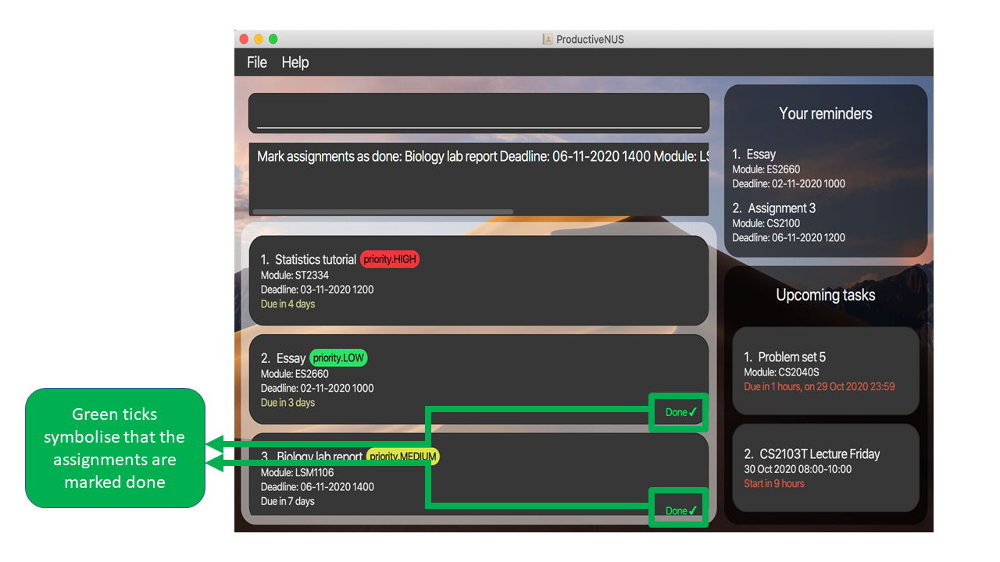
   *Figure 23: Ticks added to the completed assignments*

3) A message containing the information of the assignments marked as done will also be displayed in the [Message Box](#gui-terminologies).

   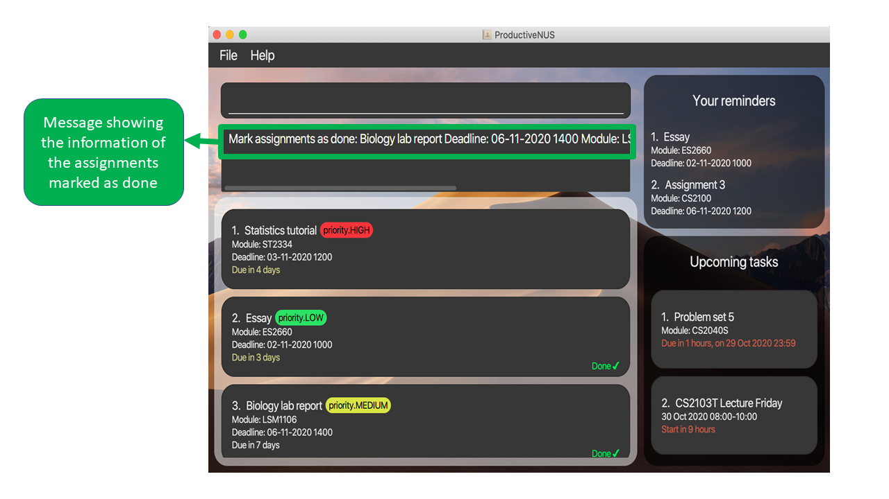
   *Figure 24: Message shown in Message Box*
   

   

  
 **:clipboard: Pointers to note:** 
* You must include at least one `INDEX`. For example, entering `done` without any `INDEX` is invalid.
* The `INDEX` that you include **must be found in your [Assignment List](#gui-terminologies)**.
* If you're marking more than one assignment as done, the `INDEXES` **must not be duplicated**. For example, `done 4 4` or `done 1 2 1` is invalid.

### Marking assignments as not done : `undone`
(Contributed by Jerry)

Format: `undone INDEX`

If you realised that you've an uncompleted assignment marked as done, you can mark the assignment as not done.
    
Similar to done, you can mark an assignment as not done by specifying the assignment's `INDEX` shown in your list.

Here is an example with steps for you to follow:

1) If you realised that the "Essay" assignment has been mistakenly marked as done,
you can simply enter `undone 2` into the [Command Box](#gui-terminologies). `2` refers to the `INDEX` of the assignment as shown in the figure below.

   
   *Figure 25: Finding the `INDEX` of the assignment*

2) The green tick associated to the assignment is no longer displayed as shown in the figure below.

   
   *Figure 26: Tick associated to assignment is no longer displayed*

3) A message containing the information of your assignment marked as not done will be displayed in the [Message Box](#gui-terminologies).

   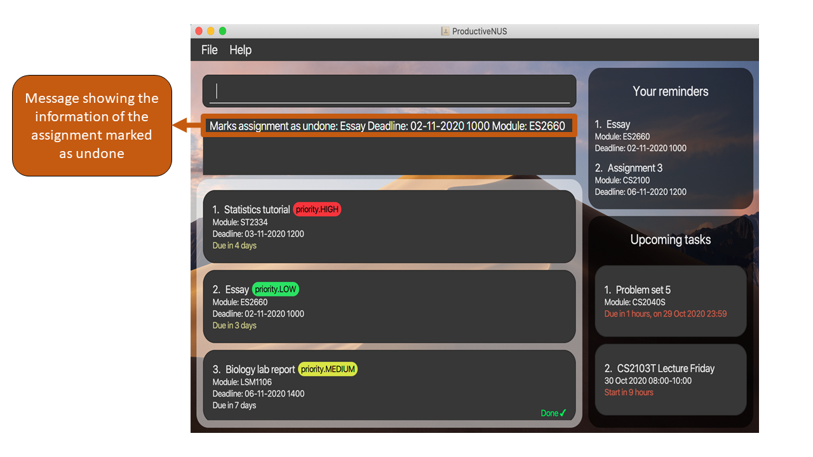
   *Figure 27: Message shown in Message Box*
   

   

  
 **:clipboard: Pointers to note:** 
* All your assignments are marked as **not done by default**.
* You must include at least one `INDEX`. For example, entering `undone` without any `INDEX` is invalid.
* The `INDEX` that you include **must be found in your [Assignment List](#gui-terminologies)**.

### Scheduling assignments: `schedule`
(Contributed by Minh)

Format: `schedule INDEX hrs/EXPECTED_HOUR af/AFTER_DATE AFTER_TIME by/BEFORE_DATE BEFORE_TIME`

You can request for a possible suggested schedule to work on your assignments so that you will not be required to manually plan a time.

You can schedule an assignment by specifying the assignment `INDEX` as shown in your [Assignment List](#gui-terminologies),
the expected hours to finish the assignment and the period of time you want to work on the assignment.

The suggested schedule with start time and end time will be displayed in the assignment card (Highlighted
in red in the figure below).

You can be ensured that the suggested time slot will not clash with any of your lessons or the suggested time
slots of other assignments.

Here is an example with steps to follow:

1) You want to schedule assignments with the name "CS2106 Lab" as shown in the figure below with an expected hour of 5 hours
and need to be done by a week from now (although the actual deadline is longer).
    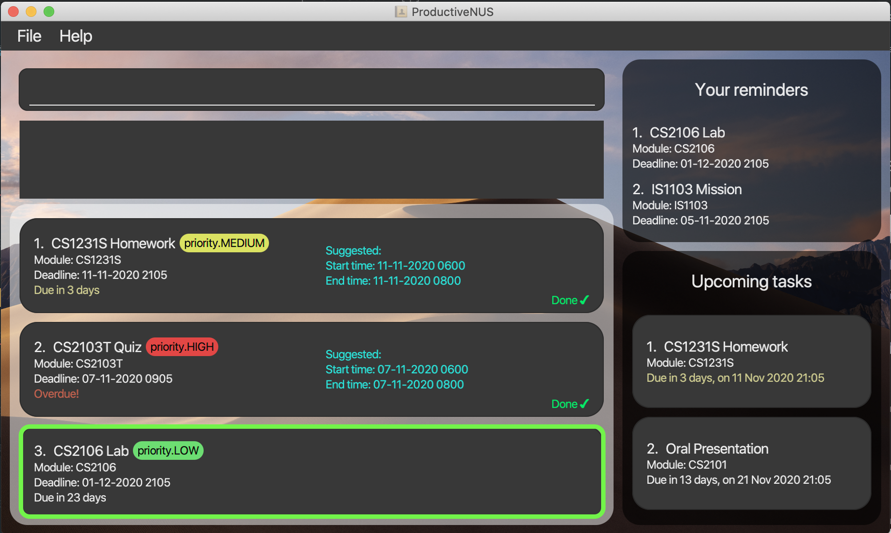
    *Figure 28: Assignment to schedule*

2) You can simply enter `schedule 3 hrs/5 af/01-01-2020 0000 by/23-12-2020 2359` into the command box.
    
    *Figure 29: Command inputted by user*

3) The suggested time slot will be displayed in the assignment card.
    
    *Figure 30: Message shown in [Command Box](#gui-terminologies) and suggested schedule displayed in the assignment card*

More examples:
* `schedule 1 hrs/2 af/23-12-2020 1800 by/23-12-2020 2359`
* `schedule 2 hrs/5 af/01-01-2020 0530 by/01-01-2021 0530`

 **:clipboard: Pointers to note:** 
* The index **must be found in your [Assignment List](#gui-terminologies)**.
* The expected number of hours **must be a positive integer between `1` and `5`**.
* `BEFORE_DATE` is in the format dd-MM-yyyy and `BEFORE_TIME` is in the format `HHmm`.

### Removing suggested time for assignments: `unschedule`
(Contributed by Minh)

Format: `unschedule INDEX`

You can remove the suggested time slot of your assignments from the [Assignment List](#gui-terminologies) by specifying the 
assignment `INDEX` as shown in your Assignment List.

For example, `unschedule 3` will remove the suggested time slot of your third assignment.
    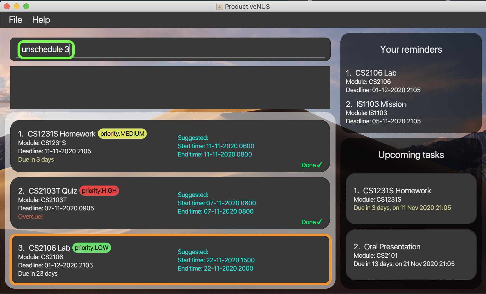
    *Figure 31: Assignment to remove the suggested schedule*
    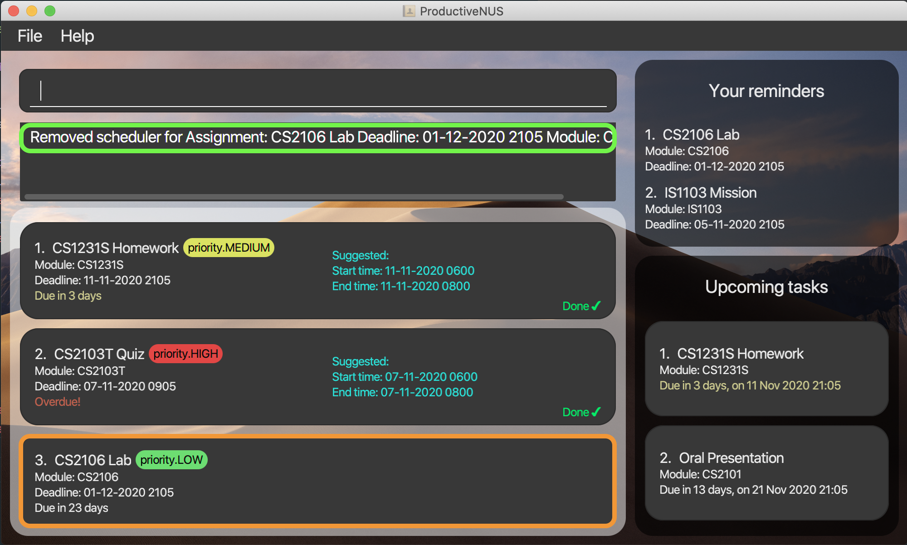
    *Figure 32: Message shown in [Command Box](#gui-terminologies) and suggested schedule removed*
       
More examples:
* `unschedule 1`
* `unschedule 3`

 **:clipboard: Pointers to note:** 
* The index **must be found in your Assignment List**.

### Undoing commands: `undo`
(Contributed by Minh)

Format: `undo`

You can undo all previous commands one at a time if you make mistakes in commands.

Here is an example with steps to follow:

1) You accidentally delete the first assignment by entering `delete 1` command.
    
    *Figure 33: Delete the first assignment*
    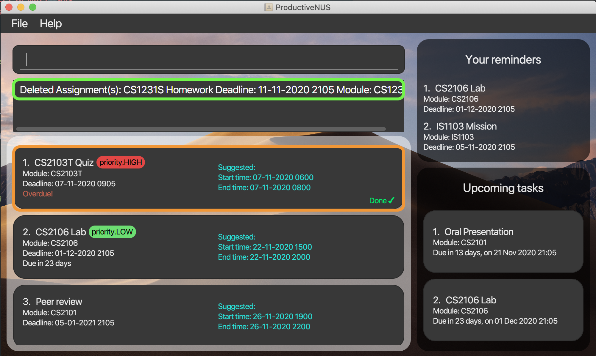
    *Figure 34: Result after deleting the first assignment*
    
2) You can enter `undo` to undo the `delete 1` command.
    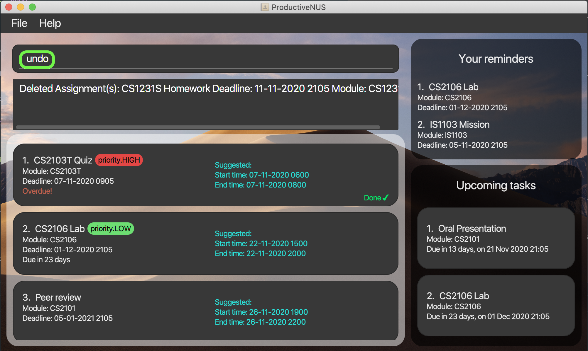
    *Figure 35: Undo the delete command*
    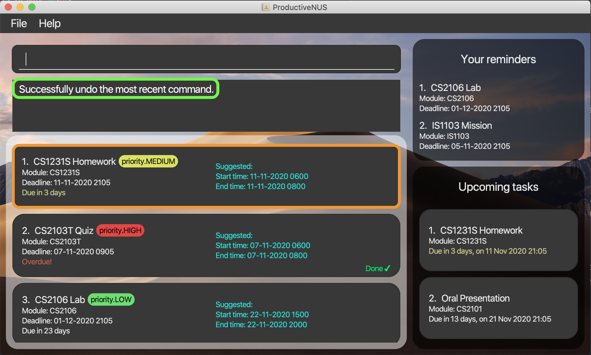
    *Figure 36: Result after undoing the delete command*
    

### Clearing all assignments: `clear`
(Contributed by Jerry)

Format: `clear`

You can clear all your existing assignments and lessons at the start of every semester.

**:bulb: Tip:**
If you cleared all your assignments and lessons by accident, use `undo` to retrieve your deleted data.

### Accessing help: `help`
(Contributed by Jerry)

Format: `help`

If you are new to ProductiveNUS or want to have a quick overview of all the available commands, you can simply enter `help` and a Help Window will appear as shown in the labelled diagram below.

   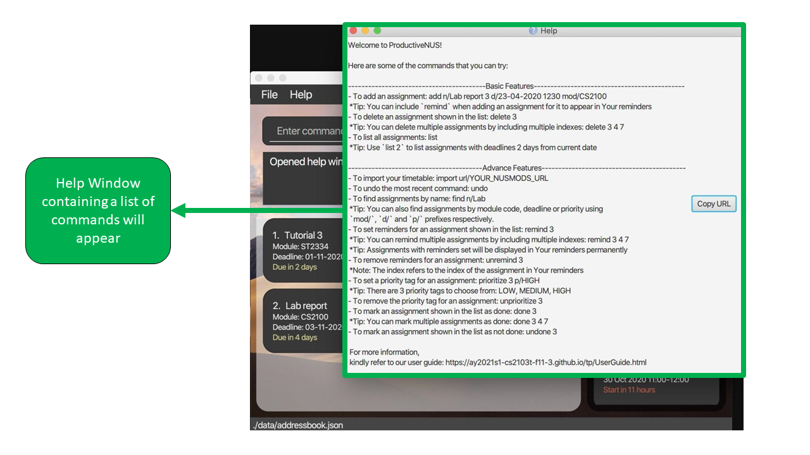
   *Figure 37: Help Window labelled*

### Exiting the program : `exit`

Format: `exit`

You can use this command to exit the program.

### Automated features and enhancements
(Contributed by Jia Xin)

#### Upcoming tasks
Your `Upcoming tasks` are updated in real time.

If the current time is pass the **deadline of an assignment or the end time of a lesson**, ProductiveNUS **automatically removes** the assignment or lesson from `Upcoming tasks`.

As such, you do not need to worry about manually updating your `Upcoming tasks` as you will receive accurate information of your academic schedule in real time.

 **:clipboard: Pointers to note:** 
Only assignments with deadlines **before** the current time and lessons with end time **before** the current time are displayed in `Upcoming tasks`. For example, if the deadline of an assignment has time `2359`, when the current time changes from `2358` to `2359`, the assignment will automatically be removed from `Upcoming tasks`.

#### Remarks on deadline of assignments and start time of lessons
You can easily view how much time you have left before your assignment is due and when your lessons start. As such, you can better plan out your time to ensure you have enough time to complete your assignments and attend your lessons on time.

For your assignments and lessons, assignments due in **more than a week's time** will be displayed in white, while assignments that are **overdue** or due in **less than a day's time** will be displayed in red as shown in the figure below.  
 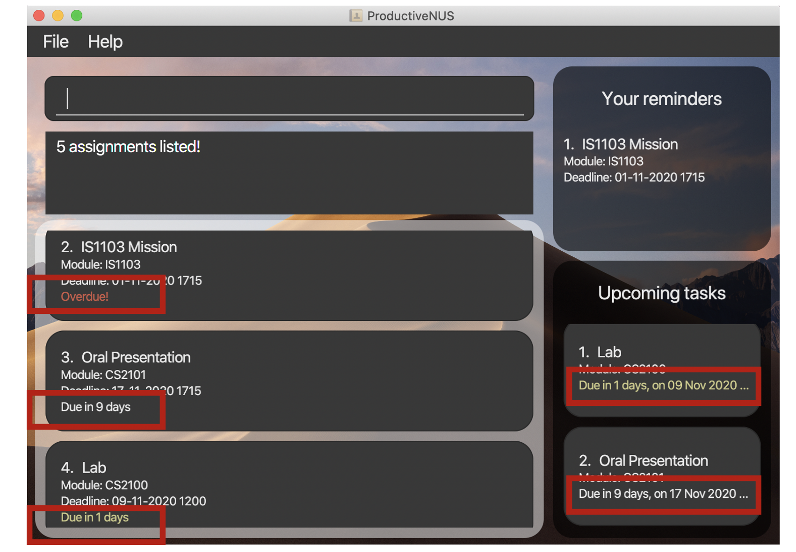
   *Figure 29: Hours or days due for assignments and lessons*
                 

 **:clipboard: Pointers to note:** 
Unlike your `Upcoming tasks`, the remarks are currently **not updated in real time**. As such, the remarks displayed is the time you have left from when you open ProductiveNUS. Only when you interact with the assignments (clicking or using the commands to alter the [Assignment List](#gui-terminologies) will the remarks get updated.
 Do look forward to the next version of ProductiveNUS to have your remarks updated in real time!

#### Saving the data

ProductiveNUS data are saved in the hard disk automatically after any command that changes the data. There is no need to save manually.

## Command summary
(Contributed by Jia Xin)

| Action | Format | Examples |
|-|-|-|
| **add** | `add n/NAME_OF_ASSIGNMENT d/DEADLINE_OF_ASSIGNMENT mod/MODULE_CODE_OF_ASSIGNMENT [p/PRIORITY_OF_ASSIGNMENT] [remind]` | `add n/PAQ d/21-03-2020 1100 mod/IS1103` |
| **delete** | `delete INDEX [MORE_INDEXES]` | `delete 3` `delete 2 3 4` |
| **import** | `import url/YOUR_NUSMODS_URL` | `import url/https://nusmods.com/timetable/sem-2/share?CS2108=LEC:1` |
| **list** | `list [NUMBER_OF_DAYS]` | `list 2` `list` |
| **find** | `find PREFIX/KEYWORD [MORE_KEYWORDS]` | `find mod/CS2103T CS2100` `find p/HIGH` |
| **edit** | `edit INDEX PREFIX/EDITED_FIELD [MORE_PREFIX/EDITED_FIELD]` | `edit 3 mod/CS2100` `edit 1 d/10-10-2020 1200` |
| **remind** | `remind INDEX [MORE_INDEXES]` | `remind 5` `remind 2 4 5` |
| **unremind** | `unremind INDEX` | `unremind 2` |
| **prioritise** | `prioritise INDEX p/PRIORITY_OF_ASSIGNMENT` | `prioritise 3 p/HIGH` `prioritise 1 p/LOW` |
| **unprioritise** | `unprioritise INDEX` | `unprioritise 1` |
| **done** | `done INDEX [MORE_INDEXES]` | `done 4` |
| **undone** | `undone INDEX` | `undone 2` |
| **schedule** | `schedule INDEX hrs/EXPECTED_HOUR af/AFTER_DATE AFTER_TIME by/BEFORE_DATE BEFORE_TIME` | `schedule 1 hrs/2 af/23-12-2020 1800 by/23-12-2020 2359` |
| **unschedule** | `unschedule INDEX` | `unschedule 1` |
| **undo** | `undo` | `undo` |
| **clear** | `clear` | `clear` |
| **help** | `help` | `help` |
| **exit** | `exit` | `exit` |

## FAQ
(Contributed by Jerry and Minh)

**Q: How do I transfer my data to another Computer?** 
**A:**  
*A* refers to the computer that you are transferring your data **from**, *B* refers to the computer that you are transferring your data **to**.

1. Install ProductiveNUS in *B* and start the app.
2. Notice that a data file named `productivenus.json` is created under the `/data` folder in *B*.
3. Close ProductiveNUS in *B*.
4. Overwrite the newly created data file in *B* with the `productivenus.json` data file from *A*.
5. Start ProductiveNUS in *B* and you should see that all your existing data has been transferred!

**Q: I am not free during the time my assignment has been scheduled. How do I reschedule?** 
**A:**
You can reschedule by using the schedule command on the assignment again. 

1. Type the schedule command into the [Command Box](#gui-terminologies) with the index of the assignment that you want to reschedule. You can refer to the figure below. 
   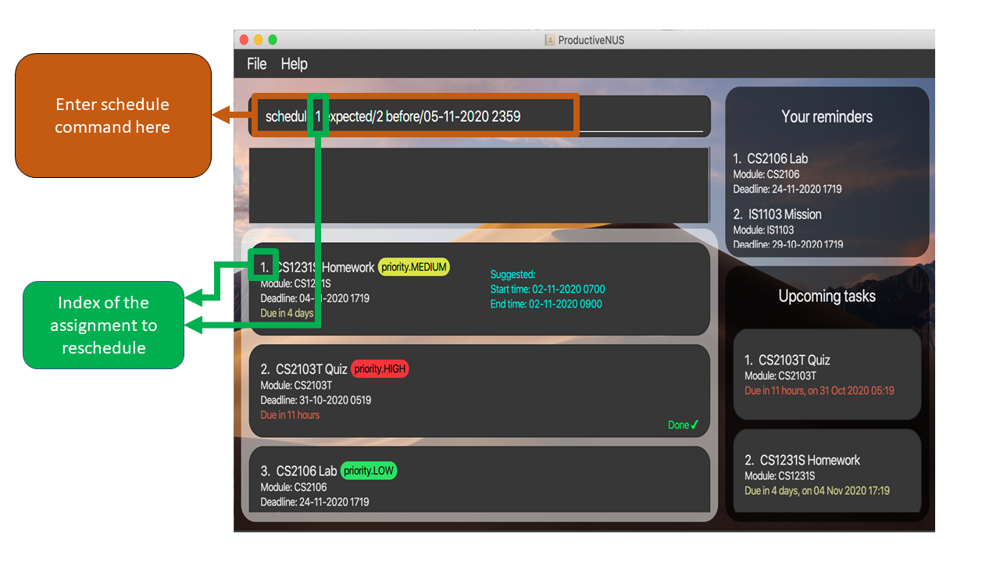
   *Figure 38: Entering schedule command into Command Box*
   
    

    **:bulb: Tip:**
    You can select and copy the entire command if you intend to reschedule the assignment more than once. 
    You can paste the command into the Command Box after step 2 and repeat step 1-2 until you have obtained your
     ideal schedule.
    

2. Press ENTER to reschedule your assignment and your assignment will be scheduled to another time or day as shown in the figure below. 
   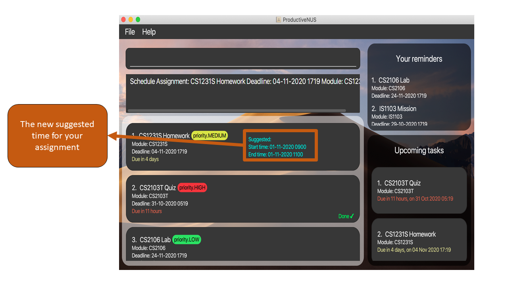
   *Figure 39: Assignment has been rescheduled successfully*
 

**Q: I double-clicked the `productivenus.jar` file but the app is not starting. What should I do?** 
**A**: This is most likely caused by the *Security and Privacy Settings* of your operating system. You can either
modify your *Security and Privacy Settings* (depends on your operating system) to accept
anonymous files or run ProductiveNUS with the `Command Prompt`.

Below are the instructions for using the `Command Prompt` to open ProductiveNUS for Windows Users.
If your computer runs Ubuntu or MacOS, the following instructions is also applicable. However, in order to
open the `Command Prompt`, you need to run the `Terminal` application.

*For Windows Users:*
1. Open the folder where you have downloaded and saved the `productivenus.jar` file.
2. Copy the file directory of the folder. You can refer to the labelled diagram below. 
   
   *Figure 40: Finding your file directory*
   
3. Open your `Command Prompt`. To do so, press the Windows key on your keyboard, type in `cmd` and press ENTER.
4. Your `Command Prompt` will start, and it should look something similar to the diagram below. 
   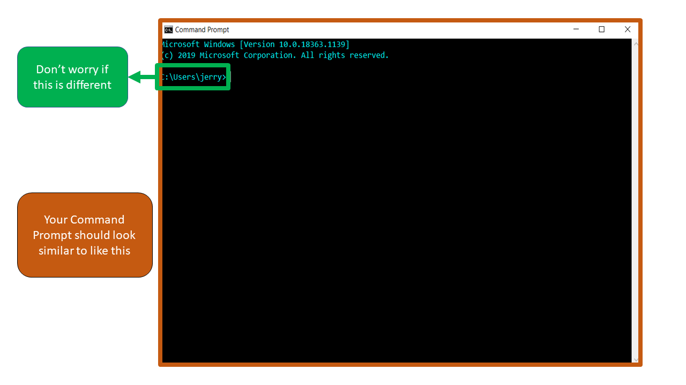
   *Figure 41: Starting the Command Prompt*
   
4. In the `Command Prompt`, type `cd ` and paste the file directory that you have copied in step 2.
 For example, `cd C:\Users\YourUserName\Desktop\ProductiveNUS`.
5. Press ENTER and the file directory will be shown in the `Command Prompt` as shown in the diagram below. 
   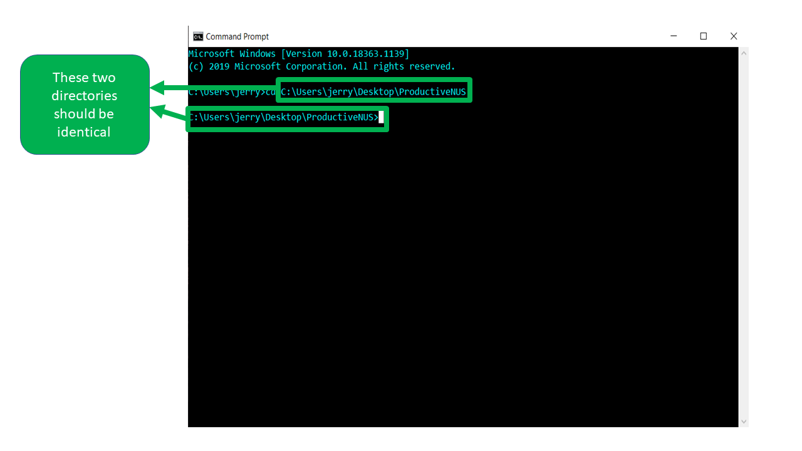
   *Figure 42: Changing file directory in Command Prompt*
   
6. Finally, type `java -jar productivenus.jar` and press ENTER to start the app.
